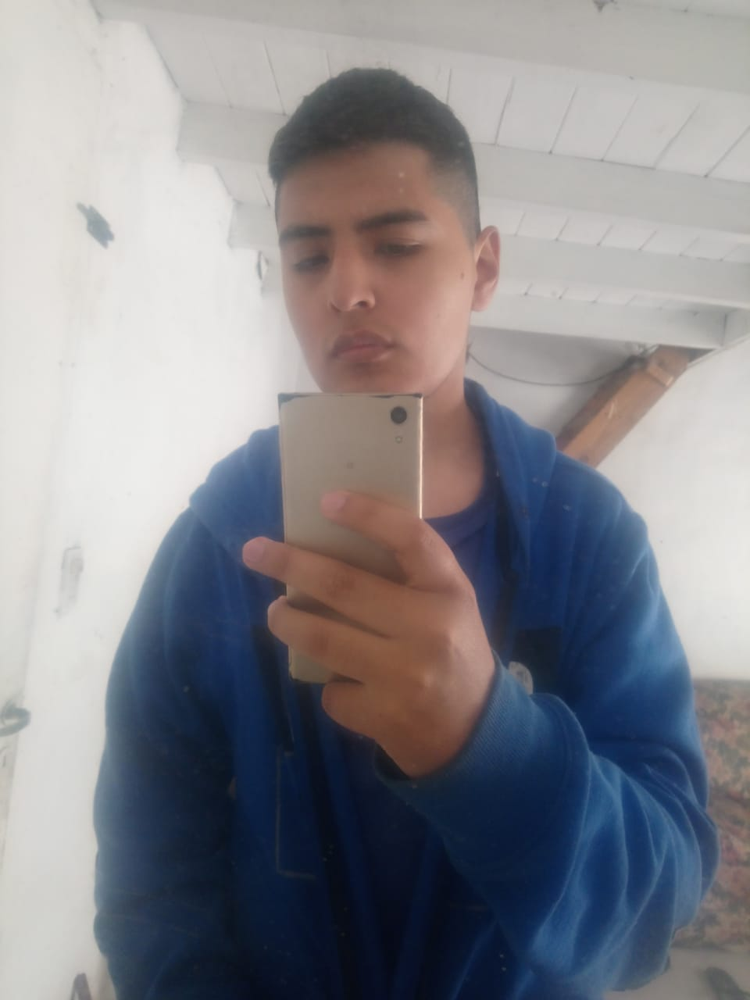
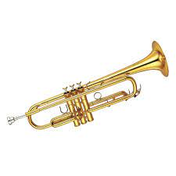

## Lautaro Uriona

## Materias Aprobadas :book:
* Introduccion a la Logica
* Matematica para informatica 1
* Organizacion de las Computadoras
* Programacion Estructurada
* Matematica para informatica 2

## Un poco sobre mi:
- [x] Soy un estudiante de la carrera de tecnicatura en programacion de la Unahur. Soy de Hurlingham pero trabajo de albañil en Bella vista. Termine la tecnicatura electronica en el Instituto Cardenal Stepinac en 2020

### Pasatiempos:
* Soy parte de la Orquesta de La UNAHUR en el sector de la trompeta    

* Tengo un canal de Youtube sobre musica de genero Instrumental/hiphop
- [] [Canal De Youtube](https://www.youtube.com/@lau-tobeats6371)
* En mis tiempos libres trato de modificar y crear mapas de un juego antiguo llamado Warcraft 3 (Cuna de varios juegos estilo MOBA y estrategia)

