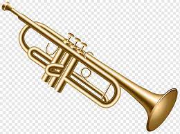

## Lautaro Uriona

## Materias Aprobadas :book:
* Introduccion a la Logica
* Matematica para informatica 1
* Organizacion de las Computadoras
* Programacion Estructurada
* Matematica para informatica 2

## Un poco sobre mi:
- [x] lol

### Pasatiempos:
* Soy parte de la Orquesta de La UNAHUR aprendiendo a tocar la trompeta

* Tengo un canal de Youtube sobre musica de genero Instrumental/hiphop
- [x] [Canal Youtube](https://www.youtube.com/@lau-tobeats6371)
* En mis tiempos libres trato de modificar y crear mapas de un juego antiguo llamado Warcraft 3 (Cuna de varios juegos estilo MOBA y estrategia)

